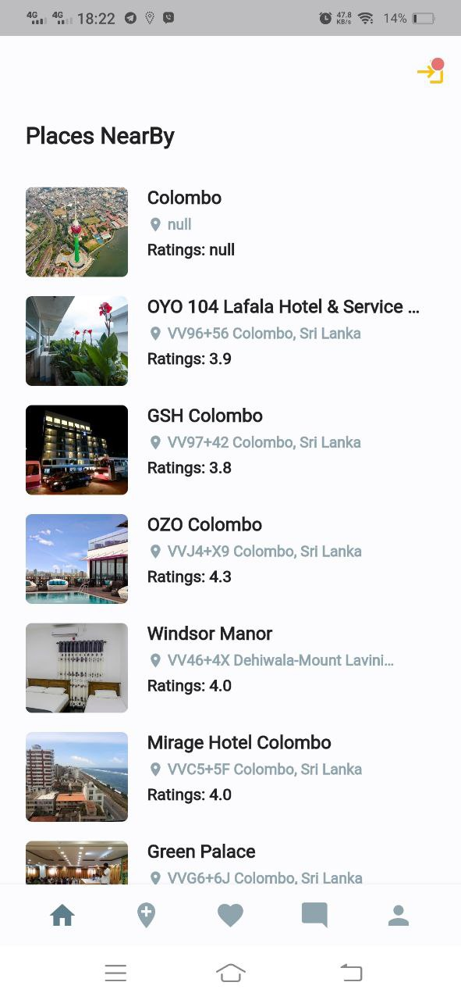

# Smart Travel Planner

Smart Travel Planner is an Online Travel Planning Application that helps travelers by recommending travel places and dynamically generating a travel itinerary considering constraints such as traveler preferences. This is an Android Mobile Application.

Introduction: [YouTube Video](https://www.youtube.com/watch?v=9VbHaTpXq-Q)

## Contributers

- [Charangan Vasantharajan](https://www.linkedin.com/in/charangan/)

## Documentations
For help getting started with our app, view our below documentations, which offers tutorials, samples, guidance on mobile development, and a full API reference.

- [Project Proposal]()
- [Project Schedule]()
- [Project Feasibility Document](https://docs.google.com/document/d/1DdIjR16eA99_wcENQOdLDDpVT8coJ16W/edit#)
- [SRS](https://docs.google.com/document/d/1WVqoB54ei-XZI7a4bMvTFo9cNAtnVppa/edit#heading=h.49x2ik5)
- [Design Document]()
- [Test Plan](https://docs.google.com/document/d/1VPCKzzdg2zFMHsGI8vO-8d0jhhNmAEM1/edit)
- [Final Report](https://docs.google.com/document/d/1ui2V2-h1RLwelKhSdNKu04iITn9bX8qf/edit)

## Screenshots

\

 
 

## Acknowledgement

- [Google Places API](https://developers.google.com/maps/documentation/places/web-service/overview)
- [Open Weather](https://openweathermap.org/)
