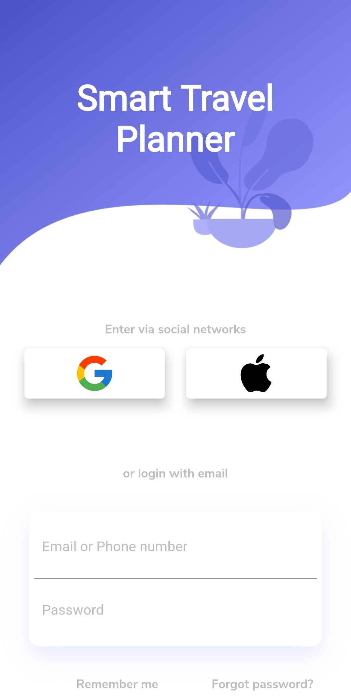
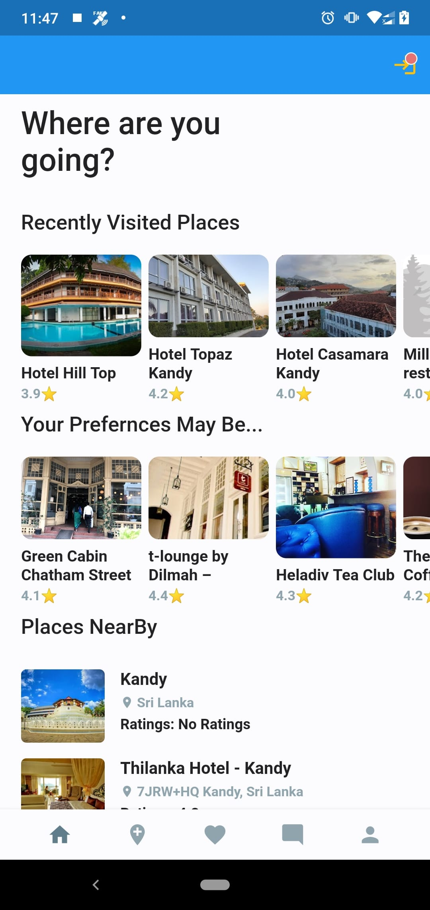
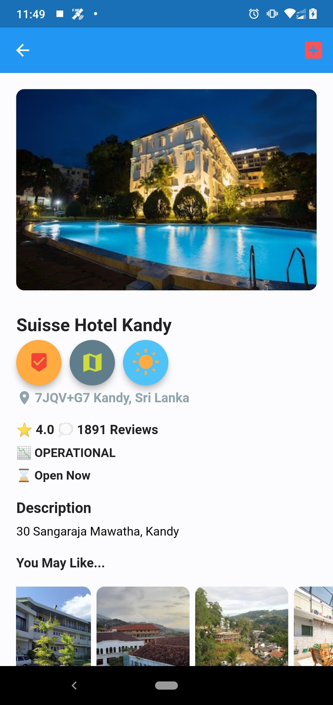
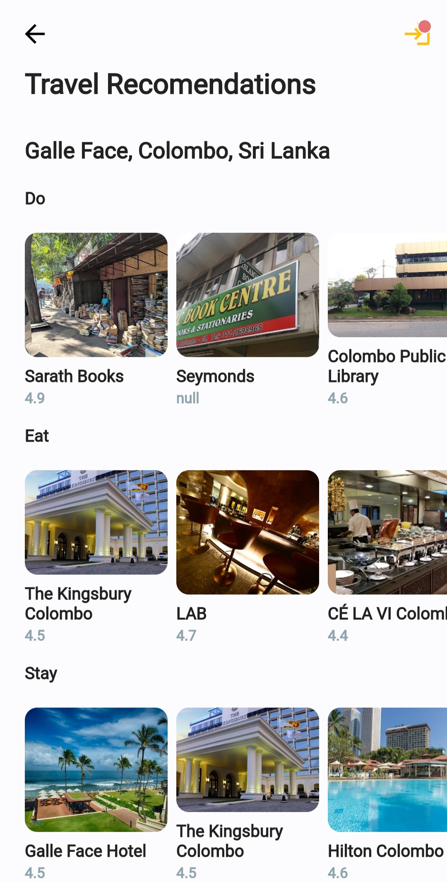
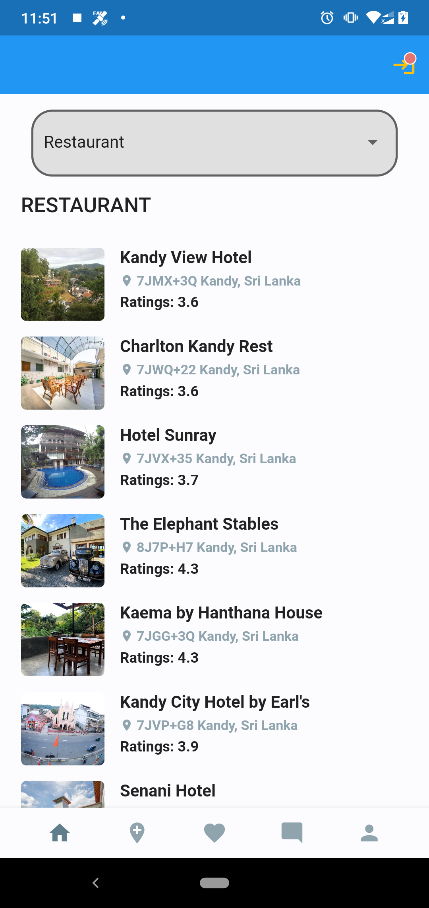
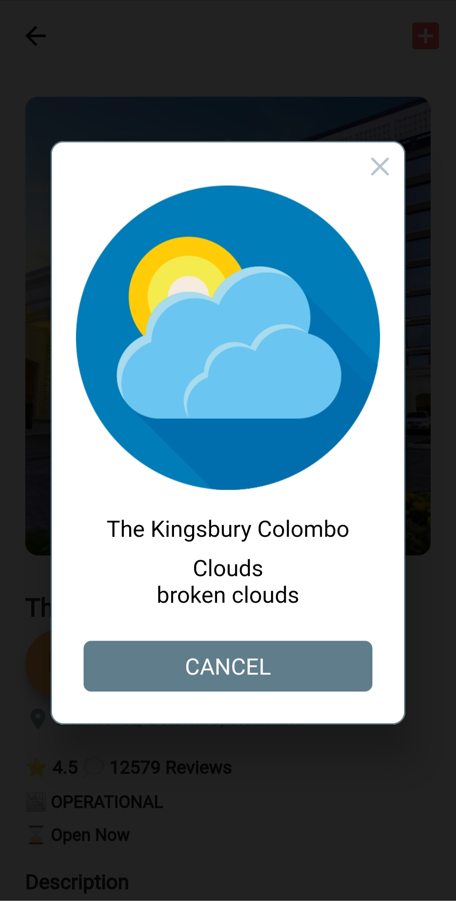

# Smart Travel Planner

Smart Travel Planner is an Online Travel Planning Application that helps travelers by recommending travel places and dynamically generating a travel itinerary considering constraints such as traveler preferences. This is an Android Mobile Application. This system provides location information, rating, reviews, and weather conditions of the places. Also, provides travel itinerary recommendations based on the user preferences.

Introduction: [YouTube Video](https://www.youtube.com/watch?v=9VbHaTpXq-Q)

## Contributers

- [Charangan Vasantharajan](https://www.linkedin.com/in/charangan/)
- [Dulaj Kavinda Dasanayake](https://www.linkedin.com/in/dulaj-kavinda-dasanayake/)
- [Maathangi Baskaran](https://www.linkedin.com/in/maathangi-baskaran/)

## Documentations
For help getting started with our app, view our below documentations, which offers tutorials, samples, guidance on mobile development, and a full API reference.

- [Project Proposal](https://docs.google.com/document/d/134SHe5b-mEbFt74IFxLUV2tA2mpe9pjz/edit?usp=sharing&ouid=109216611364830050993&rtpof=true&sd=true)
- [Project Schedule](https://drive.google.com/file/d/1GkYSc95hHLcU3sNkUbtbJylidpJbFivx/view?usp=sharing)
- [Project Feasibility Document](https://docs.google.com/document/d/1DdIjR16eA99_wcENQOdLDDpVT8coJ16W/edit?usp=sharing&ouid=109216611364830050993&rtpof=true&sd=true)
- [SRS](https://docs.google.com/document/d/1WVqoB54ei-XZI7a4bMvTFo9cNAtnVppa/edit?usp=sharing&ouid=109216611364830050993&rtpof=true&sd=true)
- [Design Document](https://docs.google.com/document/d/1o4-fJ4whHWer2rqYKpb1L7oGWE_Y3FY2/edit?usp=sharing&ouid=109216611364830050993&rtpof=true&sd=true)
- [Test Plan](https://docs.google.com/document/d/1VPCKzzdg2zFMHsGI8vO-8d0jhhNmAEM1/edit?usp=sharing&ouid=109216611364830050993&rtpof=true&sd=true)
- [Final Report](https://docs.google.com/document/d/1ui2V2-h1RLwelKhSdNKu04iITn9bX8qf/edit?usp=sharing&ouid=109216611364830050993&rtpof=true&sd=true)
- [User Manual](https://drive.google.com/file/d/1jZS6vdrQR5vDM_xe3o6D3WV-zXs75Rbz/view?usp=sharing)

### Support
- [Activity Diagrams](https://lucid.app/lucidchart/a1ea6cfb-eabb-433e-9009-cdd71e16c662/edit?viewport_loc=-409%2C20%2C2219%2C1041%2CBN61ja-nHnns&invitationId=inv_e95b9814-75b9-48ad-a0e0-bb1562cb1033)
- [Class and Sequence Diagrams](https://lucid.app/lucidchart/2095712d-63e1-422e-9106-ff23fb28b16c/edit?viewport_loc=-356%2C-86%2C4088%2C1919%2CCF0qfgCI~q76&invitationId=inv_17a6842a-111b-4992-b8ea-2049e37abb8f)

## Acknowledgement
A great thanks to:
- [Google Maps API](https://developers.google.com/maps)
- [Google Places API](https://developers.google.com/maps/documentation/places/web-service/overview)
- [Google Directions API](https://developers.google.com/maps/documentation/directions/overview)
- [Open Weather](https://openweathermap.org/)

## Screenshots

